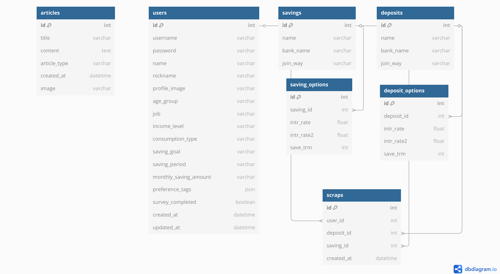

# 🏦 Faind: 금융 상품 비교 및 추천 웹 애플리케이션

**FAIND**는 **F**inance **AI** A**n**d **D**rag의 줄임말로, 생성형 AI 기반의 사용자 맞춤형 금융 상품 비교 및 추천 웹 서비스입니다.

---

## ✨ 주요 특징

- 🤖 **AI 기반 맞춤형 상품 추천**  
  사용자의 나이, 직업, 관심사를 분석하여 최적의 예·적금 상품 추천

- 📊 **금융 상품 비교 서비스**  
  예금/적금 조회 및 비교, 이자 계산기 제공

- 📈 **주식 정보 조회**  
  관심 주식 종목 검색 및 투자 계산기 제공

- 💬 **커뮤니티**  
  사용자 간 금융 의견 교류 게시판

- 🎯 **드래그 텍스트 설명**  
  텍스트를 드래그하면 AI가 금융 용어를 쉽게 설명

- 🗺️ **근처 은행 검색**  
  카카오맵 API 기반 위치 기반 은행 정보 제공

---

## 👥 팀 소개

- **팀명**: 파인
- **팀원**: 안수진, 권윤정

| 이름 | 역할 |
|------|------|
| **권윤정** | 회원 커스터마이징 및 프로필 관리, 예적금 금리 비교,  커뮤니티 , 챗봇 구현 |
| **안수진** | 관심 주식 종목 검색 및 주식 정보 조회, 근처 은행 검색, 챗봇 구현 |

---

## 👤 주요 타겟 사용자

- 금융에 관심은 있지만 지식이 부족한 일반 사용자
- 다양한 상품을 쉽게 비교하고 싶은 사용자
- 사회초년생, 재테크 입문자

---

## 🔧 개발 환경 및 기술 스택

### Frontend

- Vue.js 3
- Vue Router, Pinia
- Chart.js, Vue-ChartJS
- PrimeVue, Carousel

### Backend

- Django, Django REST Framework
- SQLite / PostgreSQL
- MarkdownX (Markdown 지원)

### AI & API

- OpenAI GPT-4 (상품 추천, 설명)
- 금융감독원 API (예적금 정보)
- 카카오맵 API (위치 기반 은행)
- 주식 API (공공데이터포털)

---

## 🗃️ ERD (Entity Relationship Diagram)
- Users (커스텀 유저 모델: 이름, 이메일, 프로필 이미지, 가입상품목록)
- Deposits, Savings (예적금 금융 상품 + 옵션 테이블)
- Scraps (예적금 금융 상품 스크랩)
- Articles (재테크 기사)




---

## 🌟 핵심 기능 요약

### 1. 회원 관리
- ✅ 회원가입 / 로그인 / 로그아웃
- ✅ 회원정보 조회 및 수정
- ✅ 비밀번호 변경 / 회원탈퇴
- ✅ 스크랩 상품 조회

### 2. 금융 상품 서비스
- ✅ 예·적금 조회 및 검색
- ✅ 금리 비교 차트 시각화
- ✅ 필터링 및 정렬
- ✅ 스크랩 기능
- ✅ 이자 계산기

### 3. 주식 서비스
- ✅ 관심 종목 검색
- ✅ 월별/주간 차트 (꺾은선, 막대)
- ✅ 투자 시뮬레이션 계산기

### 4. 커뮤니티
- ✅ 게시글 / 댓글 작성, 수정, 삭제
- ✅ 로그인 사용자만 작성 가능
- ✅ 관리자 전용 기사 작성 가능

### 5. 기타 서비스
- ✅ 카카오맵 API 기반 은행 검색
- ✅ 위치 기반/은행별 검색
- ✅ 드래그 기반 AI 금융 용어 설명

---

## 🤖 챗봇 모드

| 모드 | 설명 |
|------|------|
| 자유 질문 | 금융 관련 질문에 대한 전문적 답변 |
| 용어 설명 | 드래그한 텍스트의 금융 용어 설명 |
| 상품 추천 | 나이, 직업, 관심사 등 입력 기반 추천 |

> 🎯 드래그 → AI 설명 기능:  
> 드래그한 금융 텍스트를 쉽게 설명해주는 기능


---

## 🚀 설치 및 실행 방법

### Prerequisites

- Node.js (v14 이상)
- Python (v3.8 이상)
- pip

### Frontend
```
cd final-pjt-front
npm install
npm install vue-carousel-3d vue-chartjs chart.js primevue
npm run serve
```

### Backend
```
cd final_pjt_back
python -m venv venv
source venv/bin/activate  # Windows: venv\Scripts\activate
pip install -r requirements.txt
python manage.py makemigrations
python manage.py migrate
python manage.py runserver
```


## 🤖 금융 상품 추천 알고리즘

사용자의 개인 정보를 바탕으로 맞춤형 금융 상품을 추천합니다.
상품 추천 알고리즘

1. 1차 설문: 나이, 직업, 관심사 입력
2. 기본 추천: 금융감독원 API 데이터 기반 3가지 상품 추천
3. 2차 설문: 목적, 기간, 월별 납입 가능 금액 추가 입력
4. 정교한 추천: 더욱 정확한 맞춤형 상품 추천 및 이유 제공

# 상품 추천 시스템 프롬프트
system_prompt = (
    "당신은 금융 전문가입니다.\n"
    "아래 상품 목록을 참고하여 사용자의 조건에 맞는 상품을 3개 선택해 추천하고, 그 이유를 간단히 설명해 주세요.\n"
    "추천 대상은 단순히 금리만이 아닌 '직업 안정성, 투자 성향, 예/적금 기간' 등을 종합적으로 고려합니다."
)

## 🧠 생성형 AI 활용 내역

- OpenAI GPT-4 API 사용
  - 챗봇 형태의 상품 추천 기능 구현
  - 사용자 입력 분석 및 자연어 처리
  - **수정** 금융 단어 및 문장 설명 제공 
- 프로젝트 설계 및 기능 아이디어 브레인스토밍 시 AI 도움 활용

---

## 🎨 UI/UX 특징
- 👁️ **직관적인 UI 구성**
- 📊 **인터랙티브 차트** (Chart.js 활용)
- 🎯 **드래그 → 텍스트 설명 제공** (AI 활용)

---

## 🚧 향후 개선 계획
- 보험/펀드 등 **금융 상품 카테고리 확장**
- **실시간 주식 데이터** 연동
- **포트폴리오 개인화** 기능 추가
- **소셜 로그인** 기능 도입


## 📌 느낀 점
 **권윤정**
 - 실제 금융 데이터를 기반으로 웹 서비스를 구현하면서 금융 도메인에 대한 이해도가 높아졌습니다. 생성형 AI의 활용 가능성을 체감했고, 사용자 맞춤형 추천의 UX를 직접 설계할 수 있었던 점이 인상 깊었습니다.

 **안수진**
- 이 프로젝트를 통해 AI를 활용한 금융 서비스 개발의 가능성을 확인할 수 있었습니다. 특히 사용자 맞춤형 추천 시스템과 드래그 기반 텍스트 설명 기능은 금융 서비스의 접근성을 크게 향상시킬 수 있다는 점에서 의미가 있었습니다. 향후 더 많은 데이터와 정교한 알고리즘을 통해 더욱 정확하고 유용한 금융 상품 추천 서비스로 발전시켜 나가고 싶습니다.
